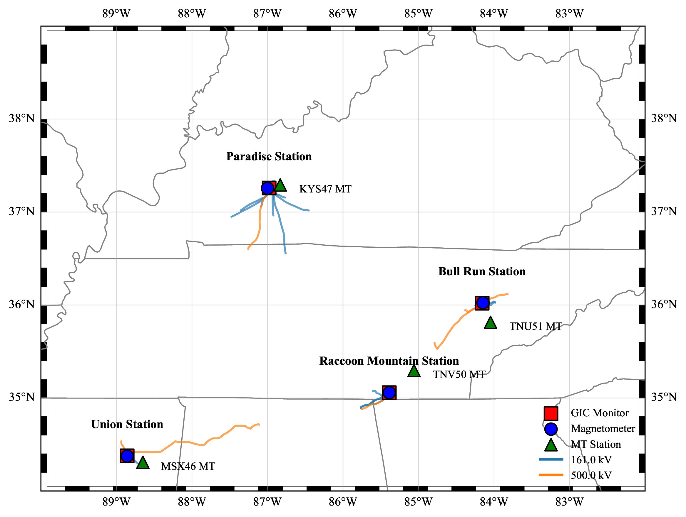
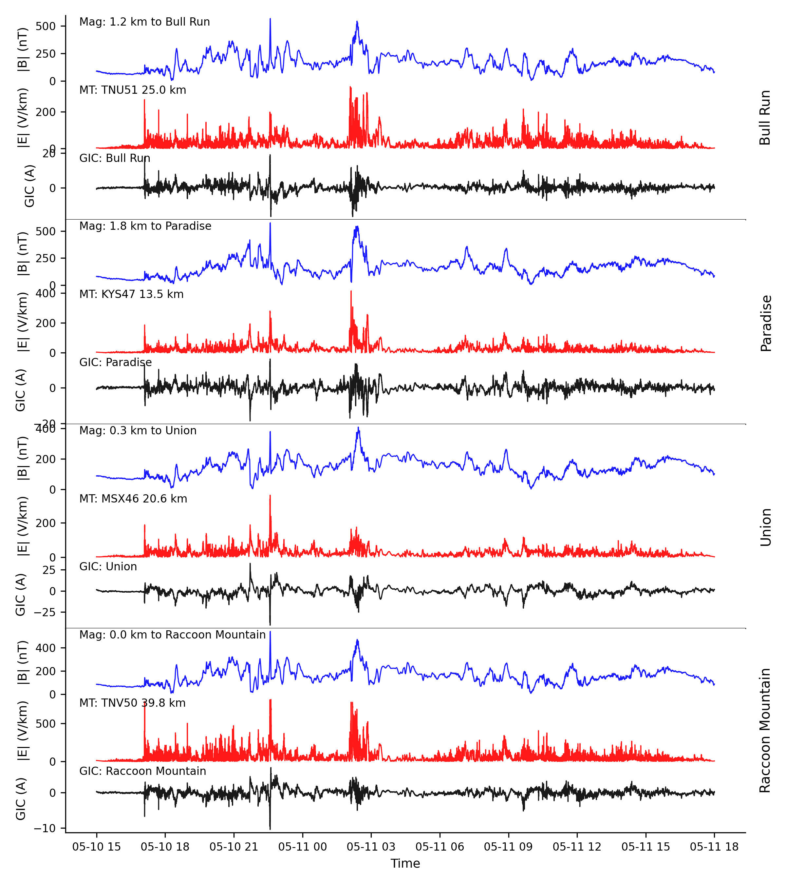
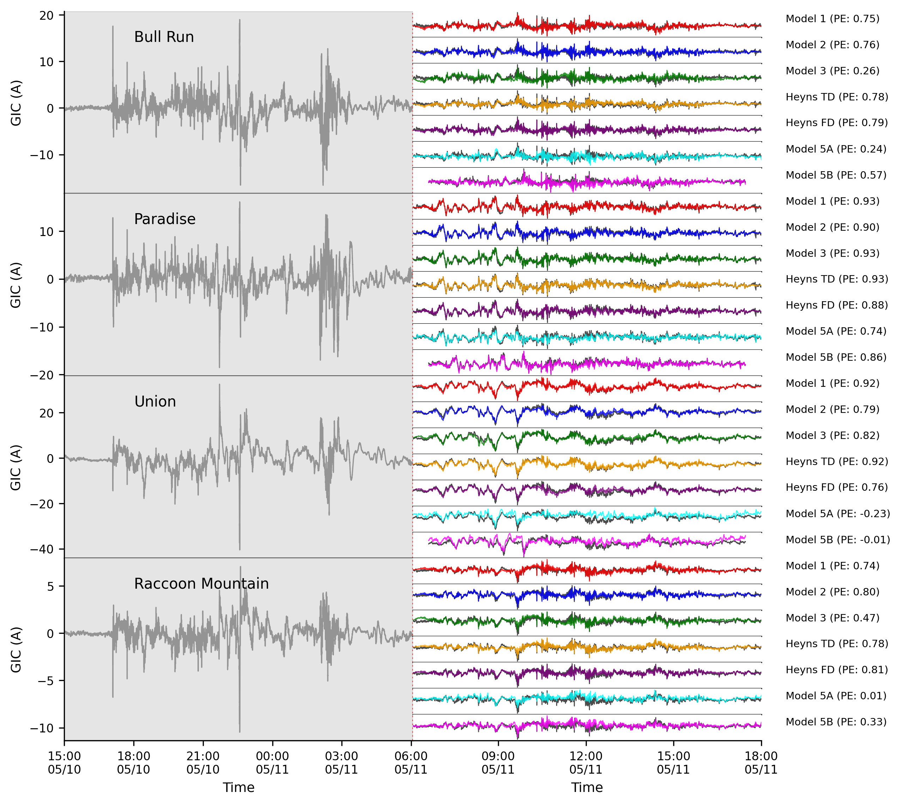

# tf_py

Geomagnetically Induced Current (GIC) prediction models for power transmission networks.

## Overview

This project implements multiple machine learning and physics-based models to predict GIC in power grids during geomagnetic storms. Uses TVA (Tennessee Valley Authority) magnetometer and GIC monitoring data.

## Study Area



TVA GIC monitoring sites across the Tennessee Valley region.

## Models Implemented

- **Model 3 (TD/FD)**: Transfer function methods using MT-derived E-fields
- **Model 4**: Frequency-domain B-field to GIC transfer function
- **Heyns Methods**: Ensemble approaches with temporal subsampling
- **Model 5a/5b**: Deep learning models (CNN, GRU, LSTM) with attention mechanisms
- **GICPINN**: Physics-informed neural network with impedance layers

## Project Structure
```
config/          - Configuration and logging utilities
scripts/         - Core modeling code (data loading, transfer functions, neural networks, PINN)
utils/           - Geographic and signal processing utilities
data/            - Dataset storage (not tracked)
models/          - Saved model weights (not tracked)
results/         - Model evaluation outputs (not tracked)
```

## Key Files

- `run_models.py`: Execute all regression-based models
- `run_pinn.py`: Train and evaluate physics-informed neural network
- `environment.yml`: Conda environment specification

## Data Requirements

- TVA GIC measurements (netCDF format)
- Magnetometer data (netCDF format)
- MT impedance tensors (pickle)
- Transmission line shapefiles

## Sample Results

### Raw Data


Time series of GIC measurements, magnetic field, and electric field for selected sites during May 2024 geomagnetic storm.

### Model Predictions


Comparison of model predictions against observed GIC at multiple sites.

## Performance Metrics

Models evaluated using Prediction Efficiency (PE), RMSE, and correlation on test data from May 2024 geomagnetic storm event.